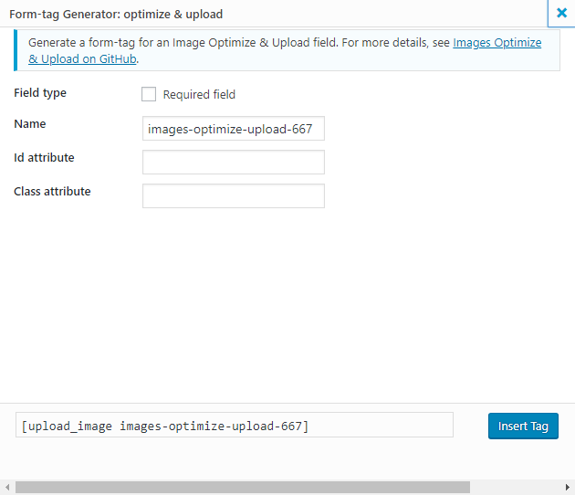

# Images Optimize and Upload CF7

[Images Optimize and Upload CF7](https://wordpress.org/plugins/images-optimize-and-upload-cf7/#description) is an extension plugin for [Contact Form 7](https://wordpress.org/plugins/contact-form-7/) plugin, that allows you to upload multiple images using drag-n-drop or simple “Browse” button, and compress them on the client’s side before sending it. If you want to save a user’s time on uploading large images, this plugin is perfect solution.

### Features
- Quick compression on the client’s side
- Save data by compressing it on the client’s side before sending to the server
- Automatically resize images to max 1920px (width or height)
- Maintains the aspect ratio of the images
- Fix image rotation issue when uploading images from Android an iOS (uses EXIF data)
- Highly customizable
- File type validation
- No limits on input file size
- Ajax upload
- Drag-n-drop or browse file
- Attach compressed files to emails
- Adapted to mobile design
- Browser compatability
- Remove or save all temp files from the server after sending the form
- Supports Google Chrome, Mozilla Firefox, Microsoft Edge. Not tested with old versions of Microsoft Internet Explorer.

#### Limitations
- Transparent background in PNG files will become solid black
- Animated GIF files will only have 1st frame after compression

### How to custom install this plugin:
- Upload the plugin files to the /wp-content/plugins/images-optimize-and-upload-cf7/ directory, or install the plugin through the WordPress plugins screen directly.
- Activate the plugin through the ‘Plugins’ screen in WordPress

### Dependency
- [client-compress](https://github.com/davejm/client-compress) - A JavaScript client side image compression library. This library uses the Canvas API to compress the image, and thus will not work on the node.js server-side. This library is forked from compress.js. This version has been updated to use the latest packages, uses async/await, fixes bugs, offers more options and a cleaner API.

## License

[MIT License](./LICENSE)

Copyright (c) :suspect: @yesworld, [@bruklig](https://github.com/bruklig)
